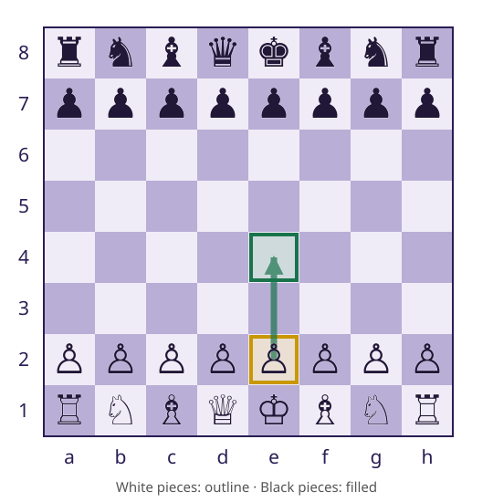
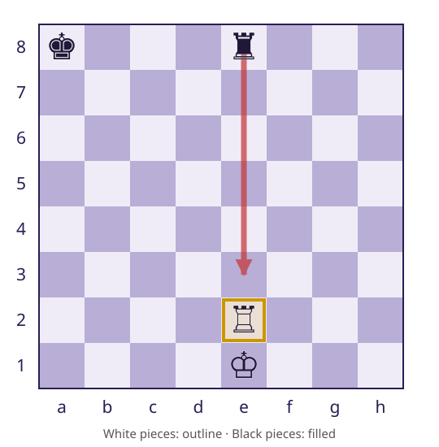
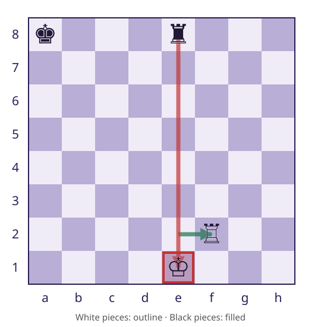
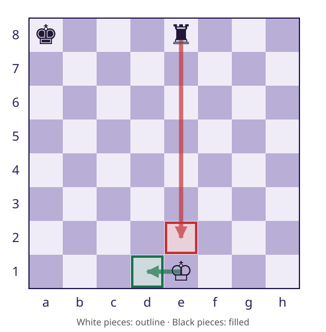

# Session 11 — Refactoring and Code Smells
### Same behavior, better structure
**CSC 413 · Week 7 · Monday Oct 5**

---

## By the end of today you can

1. Say what a refactor must preserve, and tell a refactor from a feature on the M4/M5 line
2. Read a smell — duplicate loops, mixed responsibilities, type branches, unclear names — as a question to investigate, not a verdict
3. Carry out the three M4 extractions (explicit inputs, preserved entry point, `Game` delegates) and check them with the tests plus the diff

---

# Part one — The lookup you have today

---

## Refactoring and Code Smells

:::: lesson-layout
::: lesson-context
A working move lookup meets a new chess rule: king safety.

M4 changes structure; M5 changes which moves are allowed.
:::

::: {.code-panel}
### Starting a game

```java
Game game = new Game();
```
:::
::::

::: notes
M3 behavior is the baseline. M3 is due October 5; M4 October 12, both 11:59 PM.
:::

---

## What does a refactor preserve?

:::: lesson-layout
::: lesson-context
A refactor changes internal structure while preserving observable behavior.

Return values, exceptions, board state, turn, and undo effects all count.

Moving the loop is a refactor. Adding king safety is a feature.
:::

::: {.code-panel}
### Observable behavior

- Same move list
- Same board after a query
- Same turn and history
:::
::::

::: notes
The written notes develop this example in the same order.
:::

---

## A smell is a question to investigate

:::: lesson-layout
::: lesson-context
A smell suggests a possible cost of changing the code. It does not prove incorrect behavior.

A method using two fields is not sufficient reason to extract it.
:::

::: {.code-panel}
### Examples to inspect

- Duplicate loops: can two rules drift?
- Mixed responsibilities: which changes belong together?
- Type branches: does Piece already supply the behavior?
- Unclear names: what must a reader reconstruct?
:::
::::

::: notes
The written notes develop this example in the same order.
:::

---

## Starting a game and requesting e2e4

:::: lesson-layout
::: lesson-context
`new Game()` starts with White to move.

`e2e4` requests a two-square pawn advance.

`e2e5` also names two squares, but requests an unavailable three-square move.
:::

::: {.code-panel}
### White to move


:::
::::

::: notes
The written notes develop this example in the same order.
:::

---

## From a string to a Move

:::: lesson-layout
::: lesson-context
`Game.play` accepts a `Move`. The caller has notation.

`findLegalMove` returns a matching move, or an empty Optional.

Only a found move is passed to `play`.
:::

::: {.code-panel}
### Caller code

```java
String notation = "e2e4";
Optional<Move> requestedMove = game.findLegalMove(notation);
if (requestedMove.isPresent()) {
    game.play(requestedMove.get());
} else {
    System.out.println("Move unavailable: " + notation);
}
```
:::
::::

::: notes
The example supplies a fixed string. Do not imply it reads keyboard input.
:::

---

## Matching and generation are separate jobs

:::: lesson-layout
::: lesson-context
`legalMoves()` returns the current side’s candidate list.

`findLegalMove` compares notation against that list.

Movement rules stay in the pieces.
:::

::: {.code-panel}
### Game.findLegalMove

```java
public Optional<Move> findLegalMove(String notation) {
    return legalMoves().stream()
            .filter(move -> move.toString().equalsIgnoreCase(notation))
            .findFirst();
}
```
:::
::::

::: notes
Reference implementation implementing the M3 contract. Explain stream, filter, and findFirst in order.
:::

---

## Where does the list come from?

:::: lesson-layout
::: lesson-context
Visit every square occupied by the side to move.

Ask that piece for its pseudo-legal moves. Combine the answers.

White’s starting position has 20 candidates.
:::

::: {.code-panel}
### M3 · Game.legalMoves

```java
public List<Move> legalMoves() {
    List<Move> moves = new ArrayList<>();
    for (Position from : board.positionsOf(sideToMove)) {
        Piece piece = board.pieceAt(from);
        moves.addAll(piece.pseudoLegalMoves(board, from));
    }
    return moves;
}
```
:::
::::

::: notes
The written notes develop this example in the same order.
:::

---

## What happens to e2e4?

:::: lesson-layout
::: lesson-context
The pawn on e2 contributes `e2e3` and `e2e4`. The lookup matches `e2e4`.

`play` checks membership, applies the move, records it, and changes the turn to Black.
:::

::: {.code-panel}
### Inside Game.play

```java
if (!legalMoves().contains(move)) {
    throw new IllegalArgumentException("Illegal move: " + move);
}
board.apply(move);
history.add(move);
sideToMove = sideToMove.opposite();
```
:::
::::

::: notes
Generation does not play a move; play performs the coordinated state change.
:::

---

# Part two

---

## The next rule: king safety

:::: lesson-layout
::: lesson-context
A king is **in check** when an opponent attacks its square.

A legal move must leave its own king out of check.

This applies both to exposing a safe king and escaping an existing check.
:::

::: {.code-panel}
### A blocked attack


:::
::::

::: notes
Black king a8; all unshown squares empty.
:::

---

## Why must e2f2 be rejected?

:::: lesson-layout
::: lesson-context
The rook can travel from e2 to f2.

What happens to the White king when the rook leaves the e-file?
:::

::: {.code-panel}
### Trial position


:::
::::

::: notes
The rook is pinned to its king. The move obeys geometry but fails king safety.
:::

---

## Escaping an existing check

:::: lesson-layout
::: lesson-context
With the White rook removed, the king is already in check.

`e1e2` remains on the attacked file.

`e1d1` moves to a safe square in this position.
:::

::: {.code-panel}
### Red: attacked · green: safe


:::
::::

::: notes
The written notes develop this example in the same order.
:::

---

## How could the program check safety?

:::: lesson-layout
::: lesson-context
The answer depends on the board after the candidate move.

What sequence would let the program inspect that board without playing a turn?
:::

::: {.code-panel reveal}
### A position query

1. Apply a candidate temporarily.
2. Check its own king.
3. Undo the candidate.
4. Retain it only if safe.
:::
::::

::: notes
Ask before revealing the steps. Trials must not change game turn or history.
:::

---

## Alternative: keep both loops in Game

:::: lesson-layout
::: lesson-context
The first loop collects candidates; the second tries, checks, restores, and filters them.

This could work inside `Game`.

`isInCheck` is a planned M5 helper, not supplied M3 behavior.
:::

::: {.code-panel}
### Alternative Game.legalMoves

```java
// Alternative design: collection and filtering stay inside Game.
public List<Move> legalMoves() {
    List<Move> candidates = new ArrayList<>();
    for (Position from : board.positionsOf(sideToMove)) {
        Piece piece = board.pieceAt(from);
        candidates.addAll(piece.pseudoLegalMoves(board, from));
    }

    List<Move> legal = new ArrayList<>();
    for (Move candidate : candidates) {
        board.apply(candidate);
        boolean leavesKingExposed = isInCheck(board, sideToMove);
        board.undo(candidate);
        if (!leavesKingExposed) {
            legal.add(candidate);
        }
    }
    return legal;
}
```
:::
::::

::: notes
Preserve the complete alternative from the edited notes. The normal-return version introduces restoration; Session 12 handles exceptions.
:::

---

## Trace the rejected candidate

:::: lesson-layout
::: lesson-context
After `apply(e2f2)`, the king on e1 is attacked.

`isInCheck` returns true. `undo` restores the rook to e2.

The candidate is excluded; no turn was played.
:::

::: {.code-panel}
### Inspect, then restore


:::
::::

::: notes
The written notes develop this example in the same order.
:::

---

## How could this calculation be reusable?

:::: lesson-layout
::: lesson-context
Could it accept a supplied board and color without requiring a game that manages turns and history?
:::

::: {.code-panel reveal}
### Proposed inputs

```java
List<Move> calculateMoves(
    Board board, Color color);
```
:::
::::

::: notes
Signature sketch only. Both loops need a board and color; neither needs history or turn changes. The upcoming safety calculation motivates the separation.
:::

---

# Part three

---

## M4 establishes the boundary first

:::: lesson-layout
::: lesson-context
Move the current collection loop to `MoveGenerator`.

Keep behavior unchanged in M4. Add the king-safety filter in M5.

Game continues to coordinate actual turns.
:::

::: {.code-panel}
### Responsibilities

```java
Game → MoveGenerator → Piece
          uses Board

M4: collect candidates
M5: collect + filter
```
:::
::::

::: notes
The panel is a dependency sketch, not Java source.
:::

---

## Extraction 1: make inputs explicit

:::: lesson-layout
::: lesson-context
`sideToMove` becomes the parameter `color`.

No fields; private constructor.

The helper remains package-private.
:::

::: {.code-panel}
### MoveGenerator.pseudoLegalMoves

```java
static List<Move> pseudoLegalMoves(Board board, Color color) {
    List<Move> moves = new ArrayList<>();
    for (Position from : board.positionsOf(color)) {
        Piece piece = board.pieceAt(from);
        moves.addAll(piece.pseudoLegalMoves(board, from));
    }
    return moves;
}
```
:::
::::

::: notes
After merging m4, six new tests still error until the public entry point is implemented.
:::

---

## Extraction 2: preserve the public entry point

:::: lesson-layout
::: lesson-context
In M4, the public method returns candidates unchanged.

M5 will place the filter here.

Passing tests does not establish that the old loop was removed.
:::

::: {.code-panel}
### MoveGenerator.legalMoves

```java
public static List<Move> legalMoves(Board board, Color color) {
    return pseudoLegalMoves(board, color);
}
```
:::
::::

::: notes
The written notes develop this example in the same order.
:::

---

## Extraction 3: Game delegates

:::: lesson-layout
::: lesson-context
The caller’s API remains unchanged.

The collection loop must now exist once.

Keep other Game methods and model code unchanged.
:::

::: {.code-panel}
### Game.legalMoves

```java
public List<Move> legalMoves() {
    return MoveGenerator.legalMoves(board, sideToMove);
}
```
:::
::::

::: notes
Check unused imports individually. ArrayList may still initialize history.
:::

---

## Tests check behavior; the diff checks structure

:::: lesson-layout
::: lesson-context
The M4 handout expects 48 passing tests.

Two copied loops can return equal results. Tests alone may accept both copies.

Read the diff to verify the extraction.
:::

::: {.code-panel}
### Verification

```bash
./mvnw test
git diff
git diff --check
```

Loop once · correct color · real delegation
:::
::::

::: notes
The written notes develop this example in the same order.
:::

---

## Why separate refactoring from feature work?

:::: lesson-layout
::: lesson-context
If extraction and filtering happen together, a missing move has several possible causes.

Complete the unchanged-behavior step first. Then check the new rule with distinguishing positions.
:::

::: {.code-panel}
### Different claims need different checks

- M4: same candidate set
- M5: e2f2 disappears in the pinned position
- Both: queries restore the board
:::
::::

::: notes
The written notes develop this example in the same order.
:::

---

## Which changes belong in M4?

:::: lesson-layout
::: lesson-context
Explain each choice using its effect on behavior and responsibilities.
:::

::: {.code-panel reveal}
### Review exercise

1. Move the loop and delegate.
2. Keep two copies of the loop.
3. Replace polymorphism with type branches.
4. Add king safety.
5. Rewrite history storage.
6. Remove an unused import.
:::
::::

::: notes
Required refactor: 1. Appropriate cleanup: 6 if unused. 2 duplicates; 3 reverses M2; 4 is M5; 5 outside scope.
:::

---

## Can green tests hide an unfinished refactor?

:::: lesson-layout
::: lesson-context
Explain how both implementations can agree while the loop still exists twice.

Which methods would you inspect?
:::

::: {.code-panel reveal}
### Review

**M4 due October 12, 11:59 PM.**

Next: API boundaries, attack queries, and board restoration.
:::
::::

::: notes
Inspect Game.legalMoves and MoveGenerator.pseudoLegalMoves.
:::


---

# Next: Wednesday Oct 7
**M3 due tonight 11:59 PM · M4 due Mon Oct 12**

Information hiding and clean code: the API boundary that lets M5 filter moves without rewriting Game.

We ask what Game.legalMoves promises — and what a caller can break.
