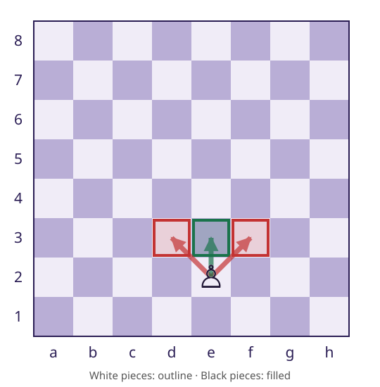
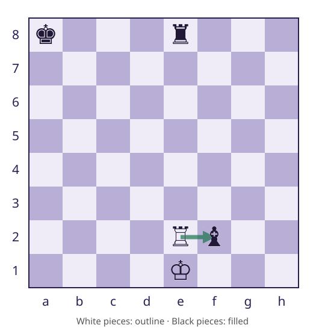
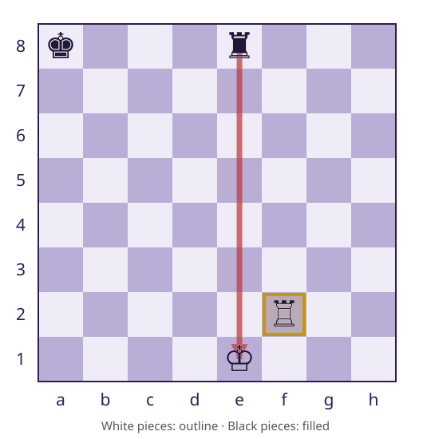

# Session 12 — Information Hiding and Clean Code
### Two promises of a move query
**CSC 413 · Week 7 · Wednesday Oct 7**

---

## By the end of today you can

1. Draw the boundary between `Game`'s public API and the generator's internals, and say what M5 adds behind it without changing callers
2. Explain why attack detection asks `Piece.attacks` rather than the opponent's legal moves — and why a pawn attacks d3 and f3 but not e3
3. Write the apply–ask–undo trial with try/finally, and spot the fragment where a `continue` leaves the board corrupted

---

# Part one — Hiding the decision

---

## What does the boundary hide?

:::: lesson-layout
::: lesson-context
Game supplies its board and current color.

The generator owns how moves are calculated.

M5 can add filtering without adding attack analysis to Game.
:::

::: {.code-panel}
### Calculation behind the API

```java
Game.legalMoves()
    → MoveGenerator.legalMoves(board, color)
        → collect candidates
        → M5: filter for king safety
```
:::
::::

::: notes
Dependency sketch, not Java source.
:::

---

## Private fields are a start

:::: lesson-layout
::: lesson-context
`private` restricts direct field access.

`final` prevents reassigning the field.

Neither makes the returned Board immutable.
:::

::: {.code-panel}
### Game.board

```java
private final Board board;

public Board board() {
    return board;
}
```
:::
::::

::: notes
Ask: what does private protect here? The field, not the Board it hands back. Anyone holding the returned object can call apply on it.
:::

---

## Can a caller bypass turn coordination?

:::: lesson-layout
::: lesson-context
Compare changing the board directly with playing a turn.

Which operation also updates turn and history?
:::

::: {.code-panel reveal}
### Two different effects

```java
game.board().apply(move);

// Coordinated operation:
game.play(move);
```
:::
::::

::: notes
The accessor exposes a mutable board. M4 retains this API; no BoardView implementation is required.
:::

---

## Public boundary, internal helper

:::: lesson-layout
::: lesson-context
Outside engine, callers use the public method intended to gain king safety.

Package-private visibility limits direct access to candidate generation.
:::

::: {.code-panel}
### M4 signature reference

| Method | Visibility |
|---|---|
| `legalMoves(Board, Color)` | `public` |
| `pseudoLegalMoves(Board, Color)` | package-private |
:::
::::

::: notes
Signatures only. Tests in engine can access the helper. Internal callers still need to choose appropriately.
:::

---

## Comments explain constraints

:::: lesson-layout
::: lesson-context
A useful comment records a reason that the operation itself does not express.

A pawn’s forward movement is not an attack.
:::

::: {.code-panel}
### Why, alongside the operation

```java
// Use attack geometry: a pawn advancing
// does not attack the square ahead.
piece.attacks(board, from, target);
```
:::
::::

::: notes
A comment that repeats the code is noise. A comment that says why the pawn's forward square is not an attack is the kind to keep.
:::

---

# Part two

---

## The filter changes the answer

:::: lesson-layout
::: lesson-context
M4 includes the rook’s geometrically available `e2f2`.

M5 must exclude it because the resulting king is exposed.
:::

::: {.code-panel}
### Same position, new rule


:::
::::

::: notes
Same position as Monday. Ask: did the rook's geometry change? No. What changed is what the move does to the king behind it.
:::

---

## Which squares does the pawn attack?

:::: lesson-layout
::: lesson-context
White pawn on e2; target squares are empty.

Does it attack d3? f3? e3?
:::

::: {.code-panel}
### Red: attacks · green: movement


:::
::::

::: notes
d3 and f3 true; e3 false. Attacks differ from movement destinations.
:::

---

## Why not ask for the opponent’s legal moves?

:::: lesson-layout
::: lesson-context
Legal-move filtering needs check detection.

If check detection asks for legal moves, it calls the filter again.

Attack geometry also differs from pawn movement.
:::

::: {.code-panel}
### Dependency path

legalMoves → isInCheck

isInCheck → isAttacked → Piece.attacks

Avoid: isAttacked → legalMoves
:::
::::

::: notes
A pinned piece can still attack a square. Attack detection does not run the legal-move filter.
:::

---

# Part three

---

## What does a capture trial remove?

:::: lesson-layout
::: lesson-context
The White rook on e2 can geometrically capture the Black bishop on f2.

During the trial, that bishop is removed from the board.
:::

::: {.code-panel}
### Before trial


:::
::::

::: notes
Other pieces: White king e1, Black rook e8, Black king a8. Candidate fails king safety.
:::

---

## What must undo restore?

:::: lesson-layout
::: lesson-context
The trial exposes the king. Reject the candidate.

Undo must restore both the rook on e2 and the captured bishop on f2.
:::

::: {.code-panel}
### During trial


:::
::::

::: notes
Returning only the moving piece loses the bishop and corrupts subsequent candidates.
:::

---

## Results and state need different checks

:::: lesson-layout
::: lesson-context
Expected moves do not prove the board was restored.

An unchanged board does not prove the returned moves are legal.
:::

::: {.code-panel}
### Distinguishing examples

- Pinned rook: candidate excluded
- Both colors: correct input used
- Pawn diagonals: attack meaning
- Capture trial: both pieces restored
- Repeated query: same board and results
- Blocked rook: attack stops at blocker
:::
::::

::: notes
Ask for one check from each row. Then: a right answer and a restored board are two different claims, and each needs its own test.
:::

---

## Three questions, three responsibilities

:::: lesson-layout
::: lesson-context
Explain why Piece.attacks is needed instead of the opponent’s legalMoves.
:::

::: {.code-panel reveal}
### Review

- Piece movement: which candidates?
- Attack query: which squares threatened?
- King safety: which candidates leave the king safe?

**M4 due October 12, 11:59 PM.**
:::
::::

::: notes
Use the pawn and recursive dependency examples.
:::


---

# Next: Monday Oct 12
**M4 due Mon Oct 12, 11:59 PM**

UML: class, sequence, component and state diagrams — M6 diagrams the engine you have been building.

M5 (check detection) opens this week; today's trial loop is its core.
